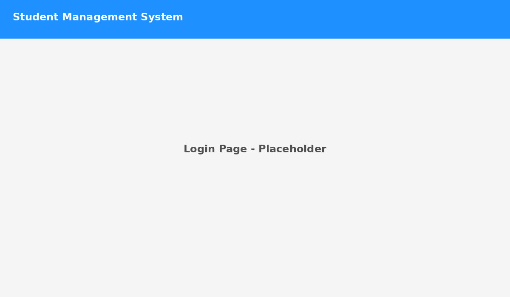
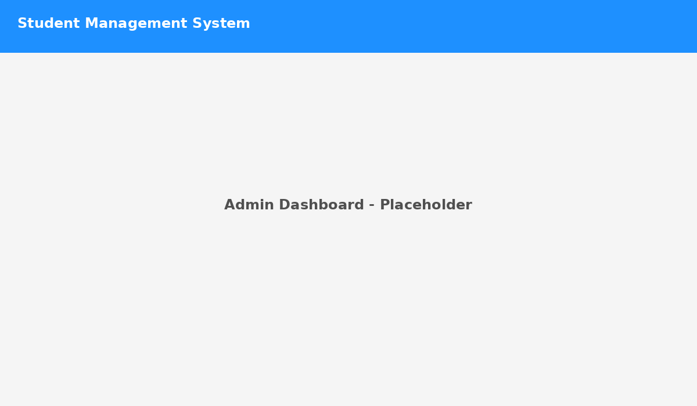

# Student Management System (SMS) 🚀

**Full-stack demo**: Admin & Student portals, attendance, announcements, tasks, and basic analytics.

<p align="center">
  
  
  
  
  
</p>

---

## 🔍 Project Overview
This repository contains a simple, well-documented Student Management System (SMS) demo built with a Spring Boot backend and a lightweight frontend. It includes sample APIs for student CRUD operations and ready-to-use placeholders for UI screenshots. The README includes attractive badges and UI preview sections to make your GitHub repo look professional.

> UI screenshots are placeholders — replace `frontend/assets/*.png` with real screenshots exported from your PPT (see `Student Management System-ppt.pdf`). fileciteturn2file0

---

## 🖼 UI PREVIEWS (placeholders)
<p align="center">
  
</p>

<p align="center">
  
</p>

<p align="center">
  
</p>

---

## 🧰 Tech Stack
- **Backend:** Java 17, Spring Boot, Spring Data JPA, MySQL  
- **Frontend:** Static HTML + JS (starter) — replace with Angular for production  
- **DevOps:** Dockerfile included for backend; CI/CD via GitHub Actions (suggested)

---

## ⚡ Quick Start (no need to run if you only want to upload)
1. Extract and upload repository to GitHub.  
2. Replace the screenshots in `frontend/assets/` with your real images from the PPT.  
3. (Optional) Update `backend/src/main/resources/application.properties` with database credentials when you run locally.

---

## 📁 Repo Structure
```
student-management-system/
├─ backend/
│  ├─ src/main/java/com/example/sms/  (Spring Boot backend files)
│  ├─ resources/ (application.properties + schema.sql)
│  └─ Dockerfile
├─ frontend/
│  ├─ index.html
│  ├─ app.js
│  └─ assets/ (UI screenshots - replace these)
├─ .gitignore
└─ README.md
```

---

## ✅ How to upload (quick)
1. Create a new GitHub repo (do not initialize with README).  
2. Upload the files (drag-and-drop) or push via Git (see instructions below).

### Git commands (if you prefer using terminal)
```bash
git init
git add .
git commit -m "Initial commit: Student Management System (attractive README + placeholders)"
git branch -M main
git remote add origin https://github.com/<your-username>/student-management-system.git
git push -u origin main
```

---

## 📌 Notes & Next Steps
- Replace placeholder images in `frontend/assets/` with screenshots from your uploaded PPT (file: `Student Management System-ppt.pdf`). fileciteturn2file0
- Consider converting frontend to Angular for full functionality.  
- Add Spring Security for role-based auth before production.

---

## 🙋 Author
**Ache Sai Ganesh** • Hyderabad  
LinkedIn: https://www.linkedin.com/in/achesaiganesh
